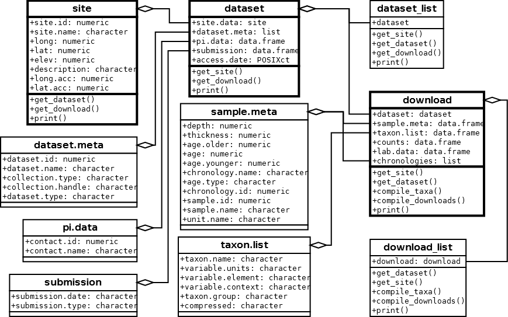
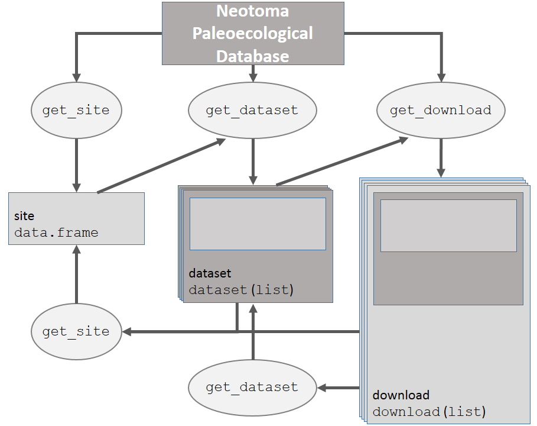
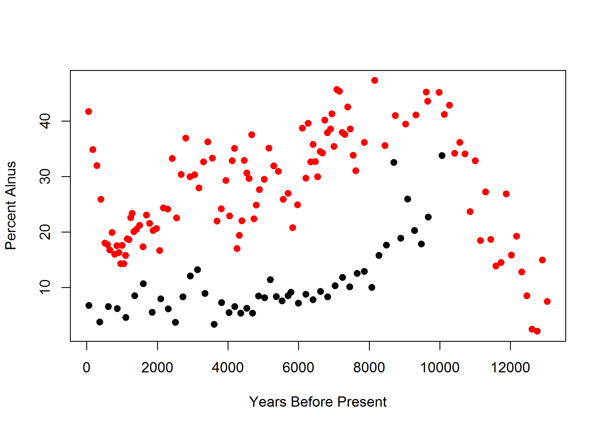
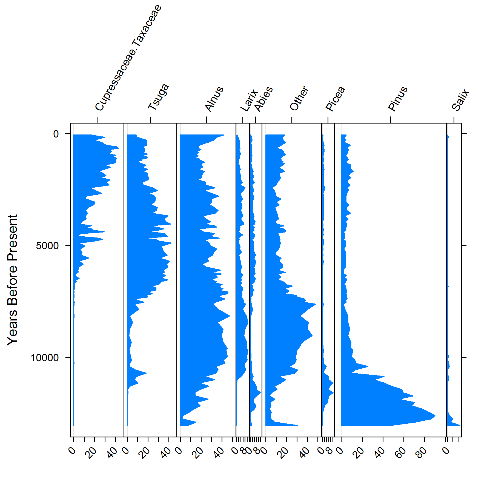
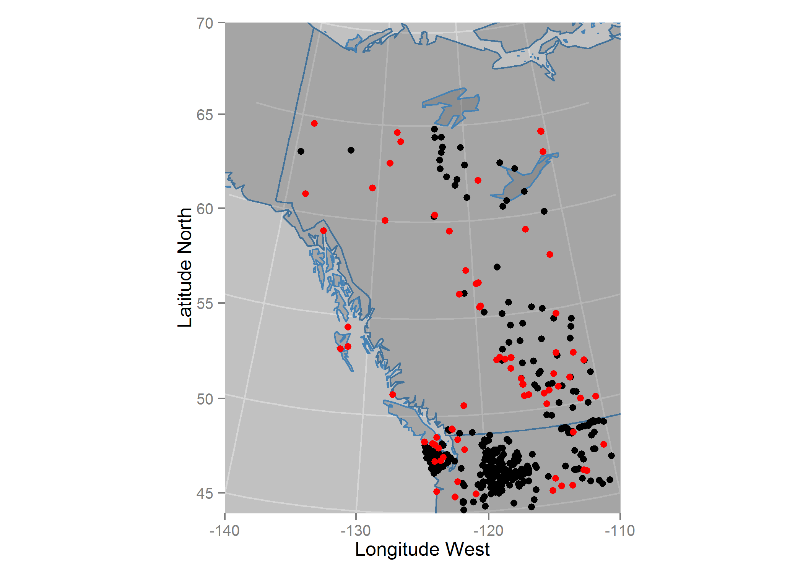
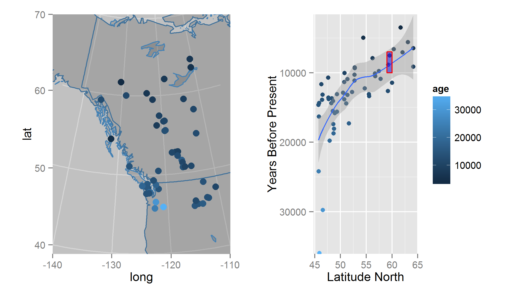
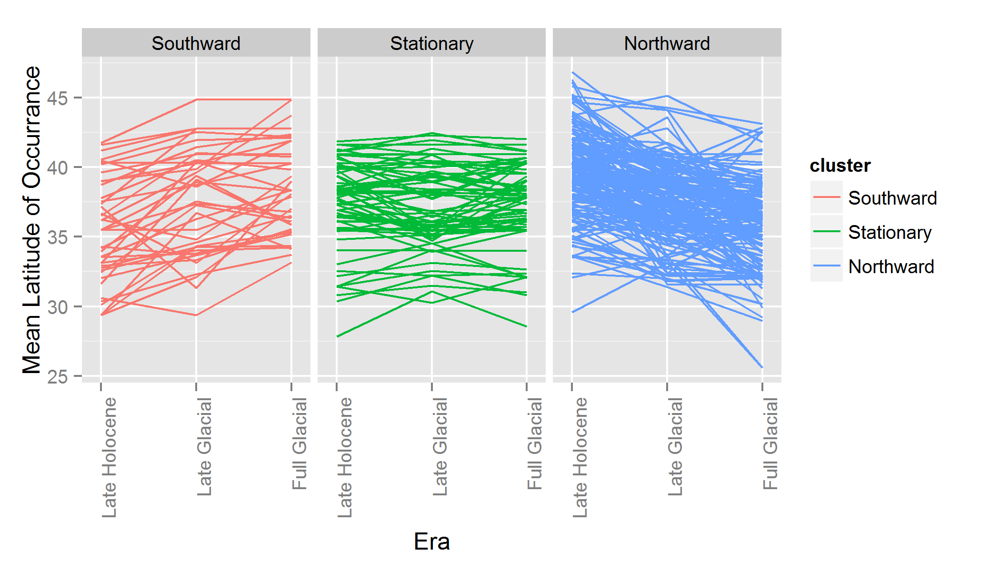

---
author: 'Simon Goring *et al*.'
biblio-files: 'neotoma_bib'
bibliography: 'neotoma_bib.bib'
csl: 'elsevier-harvard.csl'
date: '19 January, 2015'
output:
  md_document:
    variant: markdown
  pdf_document:
    pandoc_args: '-V geometry:vmargin=1in -V geometry:hmargin=1in'
title: Neotoma paper
...

neotoma: A Programmatic Interface to the Neotoma Paleoecological Database
=========================================================================

<!--


```
## Warning: package 'pander' was built under R version 3.1.2
```

```
## Warning: package 'plyr' was built under R version 3.1.1
```
-->

Simon Goring^1^ Andria Dawson^2^ Gavin L. Simpson^3^ Kathik Ram ^4^ Russ
W. Graham^5^ Eric C. Grimm^6^ John W. Williams^1,7^

^1^ Department of Geography, University of Wisconsin-Madison, Madison,
WI, USA

^2^ Department of Statistics, University of California, Berkeley, CA,
USA

^3^ Institute of Environmental Change and Society, and Department of
Biology, University of Regina, Regina, SK, Canada

^4^ Berkeley Institute for Data Science, University of California,
Berkeley. Berkeley, CA

^5^ Department of Geosciences, Pennsylvania State University, University
Park, PA, USA

^6^ Research and Collections Center, Illinois State Museum, Springfield,
IL, USA

^7^ Center for Climatic Research, University of Wisconsin-Madison,
Madison, WI, USA

Contact: <goring@wisc.edu>

Abstract:
---------

Paleoecological data are integral to ecological and evolutionary
analyses. First, they provide an opportunity to study ecological and
evolutionary interactions between communities and abiotic environments
across time scales. Second, they allow us to study the long-term
outcomes of processes that occur infrequently, such as megadroughts,
hurricanes, and rapid climate change. Third, the past allows us to study
ecological processes in the absence of widespread anthropogenic
influence.

The R package `neotoma`, described here, obtains and manipulates data
from the Neotoma Paleoecological Database (Neotoma Database:
[<http://www.neotomadb.org>]()). The Neotoma Database is a public-domain
searchable repository for multiproxy paleoecological records spanning
the past 5 million years. The Neotoma Database provides the data and
cyberinfrastructure to study spatiotemporal dynamics of species and
communities from the Pliocene to the present; `neotoma` provides a user
interface to enable these studies. `neotoma` searches the Neotoma
Database using terms that can include location, taxon name, or dataset
type (e.g., pollen, vertebrate fauna, ostracode) using the Database's
Application Programming Interface (API). The package returns a set of
nested metadata associated with the site, including the full assemblage
record, geochronological data to enable the rebuilding of age models,
dataset metadata (e.g. age range of samples, date of accession into
Neotoma, principal investigator), and site metadata (e.g. location, site
name and description). `neotoma` also provides tools to allow cross-site
analysis, including the ability to standardize taxonomies using built-in
taxonomies derived from the published literature or user-provided
taxonomies.

We show how key functions in the `neotoma` package can be used, by
reproducing analytic examples from the published literature focusing on
*Pinus* migration following deglaciation and shifts in mammal species
distributions during the Pleistocene.

Keywords: R software, neotoma, paleoecology, database, pollen, mammal

Introduction
------------

Paleoecological data are fundamental to understanding the patterns and
drivers of biogeographical, climatic, and evolutionary change, ranging
from the recent past to the dawn of life. Although individual site-level
studies have provided significant insights into past ecological
dynamics, the true power of paleoecological data emerges from networks
of data assembled to study broad-scale ecological and evolutionary
phenomena allowing us to understand ecological and evolutionary
processes and patterns through deep time
[@alroy2008phanerozoic; @raup1984periodicity; @sepkoski1997biodiversity; @barnosky2011has],
and the rapid and individualistic responses of species to the climate
changes accompanying recent glacial-interglacial cycles
[@davis1981quaternary; @graham1996spatial; @huntley1988vegetation; @tzedakis1994vegetation; @williams2004late].
Paleoecoinformatics [@brewer2012paleo; @uhen2013card] is dedicated to
providing tools to researchers across disciplines to access and use
large paleoecological datasets spanning thousands of years. These
datasets may be used to provide better insight into regional vegetation
change [@blois2013modeling; @blarquez2014disentangling], patterns of
biomass burning [@marlon2013global], or changing rates of geophysical
processes through time [@goring2012depo]. The increasing interest in
uniting ecological and paleoecological data to in order to better
understand responses to a rapidly changing world
[@fritz2013diversity; @behrensmeyer2012building; @dietl2011conservation]
will require more robust tools to access and synthesize data from the
modern and paleo time domains.

The Neotoma Paleoecological Database represents a consortium of
paleoecological databases spanning the Pliocene to the Holocene (and
Anthropocene), with distributed scientific governance and expertise, but
sharing a common database infrastructure. Constituent databases include,
the European, Latin American, and North American Pollen Databases; the
North American Plant Macrofossil Database; FAUNMAP (Pliocene to
Quaternary mammal fossils in the United States and Canada); the North
Dakota State University Fossil Insect Database; the North American
Non-Marine Ostrocode Database (NANODe); and the Diatom Paleolimnology
Data Cooperative. More information is available from the Neotoma Working
Group webpage ([<http://www.neotomadb.org/groups>]()).

Neotoma is the outgrowth of a longstanding collaboration between the
European Pollen Database and the North American Pollen Database
[@grimm2013databases] and the desire to integrate these data with faunal
and other paleo data. The database framework [@neotomamanual] was
generalized from the pollen databases (which had identical structures)
and the FAUNMAP database to accomodate both macro- and microfossil data
as well as other kinds of data such as geochemical, isotopic, and
loss-on-ignition. Work is underway to include other taxonomic groups and
depositional contexts (e.g. testate amoeba records, packrat midden
data), thus further expanding the data that can be accomodated by
Neotoma. Crucially, Neotoma is a vetted database. Through the use of
data stewards --- domain experts distributed among constituent bases who
can check for inaccuracies, upload and manage data records --- Neotoma
can support high qualitycontrol assurance for each of the constituent
data types, and receive feedback from research communities involved with
each specific data type [@grimm2013databases].

The Neotoma Database has also developed an Application Programming
Interface (API) that allow users to query the database via web services,
which return data using properly formed URL requests. For example, the
URL: [<http://api.neotomadb.org/v1/data/datasets?siteid=960>]() will
return all dataset information for the record associated with site 960,
Guardipee Lake [@barnosky1989postglacial], originally published by Cathy
Whitlock.

The analysis of paleoecological data is often performed using the
statistical software R [@RCoreTeam2014]. There are several R packages
designed specifically for paleoecological data analysis, including
`analogue` [@analogue2014; @analogue2007] and `rioja` [@rioja2013] for
paleoenvironmental reconstruction, `Bchron` [@bchron2014] for
radiocarbon dating and age-depth modeling and `paleofire` to access and
analyse charcoal data [@blarquez2014paleofire]. Given the rapid
proliferation and availability of these analytical tools in R, the
rate-limiting step for analysis has become the difficulty of obtaining
and importing data into R. This bottleneck has meant reliance on static
datasets that are available as published, and rarely updated, and on
more *ad hoc* methods such as the distribution of individual datasets
from author to analyst.

With an increasing push on the ecological community to perform and
publish reproducible research that include numerically reproducible
results
[@goring2013pollen; @goring2012depo; @wolkovich2012advances; @reichman2011challenges]
it is important to provide tools that allow analysts to directly access
dynamic datasets, and to provide tools to support reproducible
workflows. The rOpenSci project (<http://ropensci.org/>) is dedicated to
developing tools that use R to facilitate a culture shift toward
reproducible science in the ecology comunity. As part of this effort,
rOpenSci provides a number of tools that can directly interact with APIs
to access data from a number of databases including `rfishbase` for
FishBase [@boettiger2012rfishbase], and `taxize` for the Encyclopedia of
Life, iPlant/Taxosaurus and others [@chamberlain2013taxize] among
others. The `neotoma` package was developed in conjunction with ROpenSci
and represents one of two ROpenSci packages that interact with
paleoecological data along with the `paleobioDB` package
[@varela2014pbdbR].

The `neotoma` package addresses concerns regarding data access and
workflow reproducibility by providing users with tools that allow
paleoecologists to query, download, organize, and summarize data from
the Neotoma database using R. Here we describe the `neotoma` package,
then we present use cases for the package, using examples drawn from the
ecological literature, with the general objective of illustrating how
`neotoma` provides tools to perform paleoecological research in an open
and reproducible manner.

The `neotoma` package
---------------------

The `neotoma` R package is an interface between the Neotoma
Paleoecological Database ([<http://neotomadb.org>]()) and statistical
tools in R. `neotoma` uses an API to send data requests to the Neotoma
Database, and then forms data objects that are compatible for use with
existing packages such as `analogue` [@analogue2014] and `rioja`
[@rioja2013], which are used for environmental reconstruction,
manipulation, and presentation of paleoecological data. The `neotoma`
package also includes tools to standardize pollen taxon names across
sample sites using a set of published pollen taxonomies for North
America, or user defined taxonomies.



**Figure 1**. *Major classes in `neotoma`, their relations to one
another and the associated methods (functions). The classes described
below have a heavier outline than their associated variables. The class
`download` contains multiple lists, including `dataset`, which is a list
and defined class. `dataset` itself contains lists, one of which is also
a class, `site`. `neotoma` can interact directly with classes through
the use of special methods for the various functions described here.
These objects and classes are described in more detail below.*

Data in the `neotoma` package is represented in three main classes
(Figure 1): `"site"`s, `"dataset"`s (grouped into `"dataset_list"`s),
and `"download"`s (grouped into `"download_list"`s). A `"site"` is the
most basic form of spatial information representing the spatial
locations of datasets along with site names, descriptions and a unique
`site.id`. `"site"`s are `"data.frame"`s with columns `siteid`,
`sitename`, `lat`, `long`, `elev`, `description`, `long_acc`, and
`lat_acc`. These column headings are generally self explanatory;
`long_acc` and `lat_acc` are used to indicate the width of the bounding
box for a sample site (with a midpoint of `long` and `lat`). In the
Neotoma Database, examples of sites include a lake from which one or
more cores are collected, a cave from which one or more faunal
assemblages are collected, an archaeological dig with one or more
excavation pits, and so forth. Each unique site returned by the
`get_site()` search is placed in a row, providing enough descriptive
data to plot locations and understand the spatial context of a site.

Although `get_site()` is useful for first-pass surveys of data
availability, analysts more commonly will want to search for and
retrieve datasets stored in the Neotoma Database. The function
`get_dataset()` uses search terms almost identical to those used in
`get_site()`, and it returns a more complete description of the datasets
available. However, at this time only `get_site()` has the ability to
search for sites based on site names.

`"dataset"`s associated with individual sites can be obtained using
`get_dataset()`. Each search using `get_dataset()` returns a
`"dataset_list"`, a list of one or more `"dataset"`s, equal to the
number of datasets returned by the function. `get_dataset()` returns the
metadata associated with a dataset in the Neotoma Database. Neotoma's
datasets are the containers for a set of samples of the same type from a
single collection unit within a site. Examples of datasets in Neotoma
include 1) all the pollen counts from a single core from a lake, 2) all
the geochronological measurements (e..g radiocarbon dates) from a
sediment core, 3) all the faunal data from an excavation in a cave, 4)
all the plant macrofossil data from a packrat midden . In `neotoma`, a
`"dataset"` includes the `"site"` for each `"dataset"` (as
`"site.data"`, Figure 1), along with the `"dataset"` specific metadata
(`"dataset.meta"` in Figure 1). The `dataset` also includes the
principal investigator, submission date to Neotoma, and the date that
the information was accessed via the Neotoma API using the R package.
`"dataset_list"`s and `"dataset"`s can be used to access the full
`"download"` using the `get_download()` method.

`get_download()` returns an object of class `"download_list"` containing
one or more objects of class `"download"` (Figure 1). `get_download()`
will also return a confirmation message for each individual API call as
the function proceeds that can be turned off using the argument
`verbose = FALSE`. Each `"download"` contains the associated `"dataset"`
(Figure 1). The `"sample.meta"` component is where the core depth and
age information is stored. The actual chronologies are stored in
`"chronologies"`. If a core has a single age model then `"chronologies"`
has a length of one. Some cores have multiple chronologies and these are
also included in the `"chronologies"` list. The default chronology is
stored in `"sample.meta"` and is always the first chronology in
`"chronologies"`.

To build a new chronology with the same chronological controls as an
existing chronology, perhaps using a different algorithim,
`get_chroncontrol()` can be used to return the chronological controls
and the `"chronology.id"` in either `"sample.meta"` or any one of the
`"chronologies"` objects. While the chronological controls used to build
a chronology may vary across chronologies for a single site, the default
model contains the "best" chronological control data, as determined at
the time the chronologies for the collection unit were last reviewed. It
is important to note, however, that the "best" chronologies for most
collection units in the database were based on "classical" age models
[@blaauw2010methods] that do not include estimates of uncertainty.
Moreover, these default age models that are in calibrated radiocarbon
years utilize radiocarbon dates that are calibrated a priori. Bayesian
age modeling programs, such as `Bacon` [@blaauw2011flexible], which
provides estimates of uncertainty, as well as the classical age modeling
program `clam` [@blaauw2010methods], which also returns estimates of
uncertainty, utilize uncalibrated radiocarbon dates as input. Thus, the
calibrated ages of many existing age models in Neotoma will not be
appropriate for these programs, and the age controls may have to be
obtained from the geochronology table using `get_geochron()`.

The age controls of existing default radiocarbon-year chronologies may
sometimes be appropriate for programs such as `Bacon` and `clam`;
however, many of these chronologies rejected radiocarbon dates *a
priori*, which could be included when using `Bacon`. The `neotoma`
package has a function to interface directly with `Bacon` or `clam`,
called `write_agefile()`, which will output a correctly formatted age
file for either of these applications using a `"download"` object.

The `"taxon.list"` component lists taxa found in the dataset samples
(`"counts"`) and any laboratory data (`"lab.data"`), along with the
units of measurement and taxonomic grouping (Figure 1). The `"counts"`
are the actual count, presence or percentage data recorded for the
dataset. The `"lab.data"` component contains information about any spike
used to determine concentrations, sample quantities and, in some cases,
charcoal counts.



**Figure 2**. *How the main data objects relate to one another in the
`neotoma` package, and the helper functions used to move from one data
type to another.*

Each of these objects, `"site"`, `"dataset"` and `"download"` can be
obtained using direct calls to the API, or using functions defined in
the `neotoma` package (Figure 2).

Examples
--------

Here we present several examples that both introduce users to the
`neotoma` package, and highlight how `neotoma` can be used in a
paleoecological workflow. We begin with a simple example in which we
compare change in *Alnus* pollen between two sites during the late
Quaternary, followed by two more involved examples where we look at
*Pinus* migration and changes in late-Quaterary mammal distributions in
the United States.

### A simple example

A researcher is interested in finding the pollen record for Marion Lake,
in British Columbia [@mathewes1973palynological], and comparing changes
in *Alnus* pollen to the Louise Pond record [@pellatt1997holocene] from
Haida G'Waii, further north. We search for specific sites by name using
`get_site()`, making use of the wildcard `"%"` to catch sites whose site
names begin with the strings `"Marion Lake"` or `"Louise Pond"`:

``` {.r}
library("neotoma")
marion <- get_site(sitename = 'Marion Lake%')
```

      The API call was successful, you have returned  1 records.

``` {.r}
louise <- get_site(sitename = 'Louise Pond%')
```

      The API call was successful, you have returned  1 records.

``` {.r}
louise
```

                  site.id      long      lat elev
      Louise Pond    1618 -131.7533 53.41667  650
                                                                                                                                          description
      Louise Pond Glacial scour lake. Physiography: Queen Charlotte Ranges, Louise Island. Surrounding vegetation: Tsuga mertensiana, Pinus contorta.
                  long.acc lat.acc
      Louise Pond        0       0

In each case `get_site()` returns a single `"site"` (Figures 1 & 2).
Here we queried the Neotoma database for site based on `sitename`, but
alternately we could have queried for sites within a geographical
bounding box, or by geopolitical region.

To get `"dataset"`s for these records we can bind the two records
together by rows using `rbind()`, and pass the result directly to
`get_dataset()` (Figure 2):

``` {.r}
western.sites <- rbind(marion, louise)
western.data  <- get_dataset(western.sites)
```

`western.data` is a `"dataset_list"`, containing two `"dataset"`s
(Figure 1). The `"dataset"` for a site will be nested within a
`"dataset_list"`, even if only a single site is returned, so that
methods can be consistent across classes and functions. This means that
a single `"dataset"` must be retrieved as *e.g.*, `western.data[[1]]`
(this is also the case for `"download"` and `"download_list"` objects).
The use of `"dataset"` and `"dataset_list"` classes allow us to easily
move between `get_dataset()`, `get_site()` and `get_download()`. We can
see the special `print()` method for both `"dataset"`s and
`"dataset_list"`s:

``` {.r}
western.data
```

      A dataset_list containing 4 objects:
      Accessed from 2015-01-19 21:35h to 2015-01-19 21:35h. 
      Datasets:
       dataset.id                         site.name      long      lat
             1705 Marion Lake (CA:British Columbia) -122.5472 49.30833
             8377 Marion Lake (CA:British Columbia) -122.5472 49.30833
             1670 Louise Pond                       -131.7533 53.41667
             8356 Louise Pond                       -131.7533 53.41667
                 type
       pollen        
       geochronologic
       pollen        
       geochronologic

``` {.r}
western.data[[1]]
```

      A dataset for Marion Lake (CA:British Columbia)
      Accessed 2015-01-19 21:35h. 
       dataset.id                         site.name      long      lat   type
             1705 Marion Lake (CA:British Columbia) -122.5472 49.30833 pollen

before we download the full records and print them:

``` {.r}
western.dl <- get_download(western.data)
```

      API call was successful. Returned record for Marion Lake(CA:British Columbia)
      API call was successful. Returned record for Marion Lake(CA:British Columbia)
      The dataset ID 8377 is associated with a geochronology object, not count data.
      API call was successful. Returned record for Louise Pond

      Warning: 
      Modifiers are absent from the lab objects Lycopodium tablets, Sample quantity, Lycopodium spike. 
      get_download will use uniqueidentifiers to resolve the problem.

      API call was successful. Returned record for Louise Pond
      The dataset ID 8356 is associated with a geochronology object, not count data.

``` {.r}
western.dl
```

      A download_list containing 2 objects:
      Accessed from 2015-01-19 21:36h to 2015-01-19 21:36h. 
      Datasets:
       dataset.id                         site.name      long      lat
             1705 Marion Lake (CA:British Columbia) -122.5472 49.30833
             1670 Louise Pond                       -131.7533 53.41667
       age.younger age.older   type
                58     13051 pollen
                62     10065 pollen

``` {.r}
western.dl[[1]]
```

      A download object for Marion Lake (CA:British Columbia)
      Accessed 2015-01-19 21:36h. 
       dataset.id                         site.name      long      lat age.young
             1705 Marion Lake (CA:British Columbia) -122.5472 49.30833        58
       age.old   type
         13051 pollen

It is worth noting that it is possible to go directly from a `"site"`
object or set of `"site"`s to `get_download()` as well if desired.

Pollen taxonomy can vary substantially across cores depending on the
level taxonomic resolution used by a pollen analyst, or as a result of
changes to taxonomies over time. One analyst might discriminate
subgenera of *Pinus*, another might simply identify *Pinus* to the genus
level. Gramineae - a common pollen type in earlier pollen records - has
now been renamed Poaceae. This variable and shifting taxonomy is a
first-order challenge for analysts seeking to analyze the dynamics of
taxa across multiple groups. `neotoma` provides several options for
standardized taxonomic list, corresponding to three published taxonomies
for the United States and Canada
[@gavin2003statistical; @whitmore2005modern; @williams2008obtaining].
This function can be helpful, but should be used with care. The
aggregation table is accessible using the command `data(pollen.equiv)`
and the function to compile the data is called `compile_taxa()`. It can
accomodate either the internal translation table provided with the
package, or a user-defined table with the same structure as
`pollen.equiv`.

We are interested in comparing the relative pollen abundances of *Alnus*
between two sites. We compile the pollen data using the `'P25'` taxonomy
from Gavin et al. [-@gavin2003statistical]. The first record downloaded
is Marion Lake. We can see the `"download"` for Marion Lake the
`taxon.table` has 5 columns:

``` {.r}
head(western.dl[[1]]$taxon.list)
```

  taxon.name             variable.units   variable.element   variable.context   taxon.group
  ---------------------- ---------------- ------------------ ------------------ -----------------
  Cupressaceae           NISP             pollen             NA                 Vascular plants
  Corylus                NISP             pollen             NA                 Vascular plants
  Betula                 NISP             pollen             NA                 Vascular plants
  Abies                  NISP             pollen             NA                 Vascular plants
  Pinus monticola-type   NISP             pollen             NA                 Vascular plants
  Asteraceae undiff.     NISP             pollen             NA                 Vascular plants

Once we apply `compile_taxa()` to the dataset using the `'P25'`
compiler:

``` {.r}
western.comp <- compile_taxa(western.dl, list.name = 'P25')
names(western.comp) <- c("marion", "louise")
```

The `taxon.table` for Marion Lake now has an extra column (note that
several columns were removed to improve readability).

``` {.r}
head(western.comp[[1]]$taxon.list[,c(1, 5, 6)])
```

           taxon.name             taxon.group       compressed
  -------- ---------------------- ----------------- -----------------------
  **2**    Cupressaceae           Vascular plants   Cupressaceae/Taxaceae
  **29**   Corylus                Vascular plants   Corylus
  **3**    Betula                 Vascular plants   Betula
  **4**    Abies                  Vascular plants   Abies
  **5**    Pinus monticola-type   Vascular plants   Pinus
  **6**    Asteraceae undiff.     Vascular plants   Prairie Forbs

`compile_taxa()` returns a `"download_list"` or `"download"`, for which
`taxon.list` gains a column named `compressed` to link the original
taxonomy to the revised taxonomy. This linkage is an important reference
for researchers who choose to use this package for large-scale analysis,
but who might need to later check the aggregated taxonomic groups
against the original data. In this example we see that all the spore
types have been lumped into a single taxon *Other*.

The sample data (`"counts"`) contained in each `"download"` in the
`"download_list"` `western.dl` are converted into percentages using
`tran()` from the `analogue` package [@analogue2007]. We can then
compare *Alnus* pollen percentages from these two locations to learn
about vegetation changes on the west coast of North America during the
Holocene:

``` {.r}
library("analogue")

marion.alnus <- tran(x = western.comp$marion$counts, method = 'percent')[,'Alnus']
louise.alnus <- tran(x = western.comp$louise$counts, method = 'percent')[,'Alnus']

alnus.df <- data.frame(alnus = c(marion.alnus, louise.alnus),
                       ages  = c(western.comp$marion$sample.meta$age,
                                 western.comp$louise$sample.meta$age),
                       site = c(rep('Marion', length(marion.alnus)),
                                rep('Louise', length(louise.alnus))))

plot(alnus ~ ages, data = alnus.df, col = alnus.df$site, pch = 19,
     xlab = 'Years Before Present', ylab = 'Percent Alnus')
```



**Figure 3**. *Plots of* Alnus *pollen percentages at two sites, one in
the lower mainland of British Columbia (Marion Lake, red) and the other
on Haida G'waii (Louise Pond, black). Axis labels are presented as if
the code was run directly, but represent calibrated radiocarbon years
before present on the x-axis and* Alnus *pollen percentages on the
y-axis.*

Marion Lake (red, Figure 3) maintains much higher proportions of *Alnus*
pollen throughout its history, and has a rapid increase in *Alnus*
pollen during the historical period. This rapid shift in the last 200
years is likely as a result of rapid colonization by pioneer *Alnus
rubra* following forest clearance and fire in the lower mainland of
British Columbia [@mathewes1973palynological].

It is also possible to plot the pollen stratigraphy (Figure 4) at any
one site using the `Stratiplot()` function in the `analogue` package for
R [@analogue2007]. Here we plot pollen percentages for Marion Lake,
eliminating all taxa with maximum abundances less than 4% using
`chooseTaxa()`:

``` {.r}
core.pct <- data.frame(tran(western.comp[[1]]$counts, method = "percent"))
core.pct$age <- western.comp[[1]]$sample.meta$age

core.pct <- chooseTaxa(core.pct, max.abun = 4)
Stratiplot(age ~ ., core.pct, sort = 'wa', type = 'poly',
           ylab = "Years Before Present")
```



**Figure 4**. *Stratigraphic plot for Marion Lake. Age is plotted on the
y-axis in calibrated radiocarbon years before present. The `analogue`
package provides the opportunity for users to further customize the
stratigraphic plot if so desired.*

### *Pinus* migration following the last Glacial Maximum

Macdonald and Cwynar [-@macdonald1991post] used *Pinus* pollen
percentages to map the northward migration of lodgepole pine (*Pinus
contorta* var *latifolia*) following the retreat of the Laurentide Ice
Sheet and the accompanying rise of temperatures in the late-Glacial and
early Holocene. In their study a cutoff of 15% *Pinus* pollen was
defined as the indicator of *Pinus* presence. Strong and Hills
[-@strong2013holocene] have remapped the migration front using a lower
pollen proportion (5%) and more sites. Here, the analysis is partially
replicated. Note that additional R packages must be installed and loaded
for the following examples.

A spatial bounding box delimiting sites is defined for the search.
Strong and Hills [-@strong2013holocene] use a region approximately
bounded by 54^o^N and 65^o^N, and from 110^o^W to 130^o^W. The function
`get_site()` can return all sites within a slightly expanded bounding
box:

``` {.r}
#install.packages('ggmap', 'ggplot2', 'reshape2', 'Bchron', 'gridExtra')
library("ggmap")
library("ggplot2")
library("reshape2")
library("Bchron")
library("gridExtra")

all.sites <- get_site(loc = c(-140, 45, -110, 65))
```

      The API call was successful, you have returned  461 records.

The code above returned 461 sites. To narrow down the search we will use
`get_dataset()` to search for all *Pinus* taxa within the same bounding
box as above. `get_dataset()` can also limit the type of dataset, either
by looking for specific taxa, or by describing the dataset type (e.g.,
`datasettype = 'pollen'` or `datasettype = 'mammal'`). The `%` wildcard
indicates that any characters may follow a string starting with
`"Pinus"`:

``` {.r}
all.datasets <- get_dataset(loc = c(-140, 45, -110, 65),
                            datasettype = 'pollen',
                            taxonname = 'Pinus%')
```

The API returned 74 datasets. Many dropped sites were pollen surface
samples, or sites with datasets for other taxonomic groups. The
distribution of the 74 fossil pollen sites can be plotted over the
original 461 sites. We use the `ggplot2` package [@wickham2009ggplot2]
to make the figures:

``` {.r}
map <- map_data('world')
ggplot(data = data.frame(map), aes(long, lat)) + 
  geom_polygon(aes(group=group), color = 'steelblue', alpha = 0.2) +
  geom_point(data = all.sites, aes(x = long, y = lat)) +
  geom_point(data = get_site(all.datasets),
  aes(x = long, y = lat), color = 2) +
  xlab('Longitude West') + 
  ylab('Latitude North') +
  coord_map(projection = 'albers', lat0 = 40, lat1 = 65, 
            xlim = c(-140, -110), ylim = c(45, 70))
```



**Figure 5** *Mapped sites with pollen cores in British Columbia,
Alberta and the Yukon Territory of Canada (red), including other Neotoma
sites without stratigraphic pollen data (black).*

The map (Figure 5) shows a number of sites in the interior of British
Columbia that have no fossil pollen. There are also other sites not
shown here that may have relevant data but have yet to be entered into
the database. This highlights a common challenge in paleoecoinformatics
--- the import of individual records into data repositories takes some
time and is an on-going process that is aided by the collective
contributions of the original analysts, data stewards, and large-scale
research initiatives (e.g. PAGES 2K, PalEON). Fortunately, new software
tools are speeding up the process of uploading and vetting data. The
Tilia software ([<http://www.neotomadb.org/data/category/tilia>]()) has
been updated to allow direct upload to the Neotoma Database and includes
a large number of automated data quality checks and standardized look-up
tables for variable names. Because `neotoma` directly links to the
Neotoma Database via APIs, analyses using `neotoma` can be updated
continuously as new sites are added.

To obtain the data for the 74 sites we use `get_download()`:

``` {.r}
all.downloads <- get_download(all.datasets, verbose = FALSE)
```

Only the percentage of *Pinus* is of interest, so we can again compile
the taxa across the `"download_list"` using the 'P25' taxonomy
[@gavin2003statistical]:

``` {.r}
compiled.cores <- compile_taxa(all.downloads, 'P25')
```

We want to determine which sample has the first local *Pinus* presence
in each core using a cutoff of 5% [@strong2013holocene]. We can find
which rows in the *Pinus* column in each `"download"`'s `"count"` data
frame have presence over 5% and then find the highest row number since
the samples in a dataset are ordered stratigraphically, with the
youngest sample in the top row and the oldest sample in the bottom row.
This is a more complicated example. We first have to write a function
that can take pollen count data

``` {.r}
top.pinus <- function(x) {
  x.pct <- tran(x$counts, method = "proportion")
  #  Cores must span at least the last 5000 years (and have no missing dates):
  old.enough <- max(x$sample.meta$age) > 5000 & !all(is.na(x$sample.meta$age))
  #  Find the highest row index associated with Pinus presence over 5%
  oldest.row <- ifelse(any(x.pct[, 'Pinus'] > .05 & old.enough),
                       max(which(x.pct[, 'Pinus'] > .05)),
                       0)
  #  return a data.frame with site name & location, and the age and date type
  #  (since some records have ages in radiocarbon years) for the oldest Pinus.
  out <- if (oldest.row > 0) {
      data.frame(site = x$dataset$site.data$site.name,
                 lat = x$dataset$site.data$lat,
                 long = x$dataset$site.data$long,
                 age = x$sample.meta$age[oldest.row],
                 date = x$sample.meta$age.type[oldest.row])
  } else {
      NULL
  }
  out
}

#  Apply the function 'top.pinus' to each core using lapply and rbind:
summary.pinus <- do.call("rbind.data.frame", lapply(compiled.cores, top.pinus))
```

We need to calibrate dates that are recorded in radiocarbon years using
the `Bchron` package [@bchron2014]. In most cases the original
uncertainty for individual ages is not recorded in `"sample.meta"` so we
assume a 100 year standard deviation. Note that direct recalibration of
radiocarbon dates from interpolated age models is not the best approach,
but is sufficient for our purposes here:

``` {.r}
radio.years <- summary.pinus$date %in% 'Radiocarbon years BP'
sryears <- sum(radio.years, na.rm = TRUE)
# BChronCalibrate is in the BChron package:
calibrated <- BchronCalibrate(summary.pinus$age[radio.years],
                              ageSds = rep(100, sryears),
                              calCurves = rep('intcal13', sryears))

#  we want the weighted means from 'calibrated'
wmean.date <- function(x) sum(x$ageGrid*x$densities / sum(x$densities))

summary.pinus$age[radio.years] <- sapply(calibrated, wmean.date)
summary.pinus <- na.omit(summary.pinus)
summary.pinus <- subset(summary.pinus, subset=!(age < 2000 & long < -130))

#  A loess curve is straightforward, but not the best model:
regress <- ggplot(summary.pinus, aes(x = lat, y = age)) +
                  geom_point(aes(color = age), size = 2) +
                  scale_y_reverse(expand = c(0, 100)) +
                  xlab('Latitude North') + 
                  ylab('Years Before Present') +
                  geom_smooth(n = 40, method = 'loess') +
                  geom_rect(aes(xmin = 59, xmax = 60, ymin = 7000, ymax = 10000), 
                  color = 2, fill = 'blue', alpha = 0.01)

mapped <- ggplot(data = data.frame(map), aes(long, lat)) + 
                 geom_polygon(aes(group = group), color = 'steelblue', alpha = 0.2) +
                 geom_point(data = summary.pinus, 
                 aes(x = long, y = lat, colour = age), size = 3) +
                 coord_map(projection = 'albers', lat0 = 40, lat1 = 65, 
                 xlim = c(-140, -110), ylim = c(40, 70)) +
                 theme(legend.position = 'none')

grid.arrange(mapped, regress, nrow=1)
```



**Figure 6**. *Mapped ages of first* Pinus *establishment in the
interior of British Columbia and the Yukon Territory based on a 5%
pollen cut-off. The age of first appearance is also plotted and smoothed
with a loess curve.*

The results show a clear pattern of northward expansion for *Pinus* in
northwestern North America (Figure 6). These results broadly agree with
the findings of Strong and Hills [-@strong2013holocene] who suggest that
*Pinus* reached a northern extent between 59^o^N and 60^o^N at
approximately 10--7 ka cal BP as a result of geographic barriers before
continuing northward after 7 ka cal BP.

### Mammal Distributions in the Pleistocene

Graham et al. [-@graham1996spatial] built and applied the FAUNMAP
dataset ([<http://www.ucmp.berkeley.edu/faunmap/>]()) of fossil
assemblages to elucidate patterns of change in mammal distributions
through the Pleistocene to the present. The paper uses various
multivariate analyses to show, in part, that mammal species have
responded in a Gleasonian manner to climate change since the
late-Pleistocene. Graham et al. [-@graham1996spatial] show some species
migrating northward in response to warming climates, others staying
relatively stable, and some moving southward. FAUNMAP has been
incorporated into Neotoma (and expanded with new records), and this
example performs some simple analyses that show how different species
responded to the changing climate of the last deglaciation.

First, all vertebrate fauna datasets are obtained from Neotoma:

``` {.r}
#  Bounding box is effectively the continental USA, excluding Alaska
mam.set <- get_dataset(datasettype= 'vertebrate fauna',
                       loc = c(-125, 24, -66, 49.5))
#  Retrieving this many sites can be very time consuming
mam.dl <- get_download(mam.set)
```

Sites are assigned to time-period bins as in Graham et al.
[-@graham1996spatial]; Modern (\< 0.5 ka cal BP), Late Holocene (0.5-- 4
ka cal BP), Early-Mid Holocene (4--10 ka cal BP), Late Glacial (10--15
ka cal BP), Full Glacial (15--20 ka cal BP) and Late Pleistocene (\> 20
ka cal BP). The first step is to build a large table with `time` and
`xy` coordinates for each site. Time data in `"sample.meta"` for the
mammal data is not the same as for for pollen where age is commonly
found in the `sample.meta$age` component. Most vertebrate fauna samples
are assigned only younger (`sample.meta$age.younger`) and older
(`sample.meta$age.older`, Figure 1) bounds with no estimates of mean or
median age. In this example we average the younger and older ages to
determine sample age. We recognize that this averaging of ages is likely
to be methodologically indefensible in the scientific literature, but is
sufficient for illustrative purposes here. Here we make use of the
`reshape2` package [@reshape2007] to help manipulate data structures.

``` {.r}
compiled.mam <- compile_downloads(mam.dl)
time.bins <- c(500, 4000, 10000, 15000, 20000)
mean.age <- rowMeans(compiled.mam[,c('age.old', 'age.young', 'age')],
                     na.rm = TRUE)
interval <- findInterval(mean.age, time.bins)
periods <- c('Modern', 
             'Late Holocene', 
             'Early-Mid Holocene', 
             'Late Glacial', 
             'Full Glacial', 
             'Late Pleistocene')
compiled.mam$ageInterval <- periods[interval + 1]
mam.melt <- melt(compiled.mam,
                 measure.vars = 10:(ncol(compiled.mam)-1),
                 na.rm = TRUE,
                 factorsAsStrings = TRUE)
mam.melt <- transform(mam.melt, ageInterval = factor(ageInterval, levels = periods))
mam.lat <- dcast(data = mam.melt, variable ~ ageInterval, value.var = 'lat',
                 fun.aggregate = mean, drop = TRUE)[,c(1, 3, 5, 6)]
#  We only want taxa that appear at all time periods:
mam.lat <- mam.lat[rowSums(is.na(mam.lat)) == 0, ]
#  Group the samples based on the range & direction (N vs S) of migration.
#  A shift of only 1 degree is considered stationary.
mam.lat$grouping <- factor(findInterval(mam.lat[,2] - mam.lat[, 4],
                                        c(-11, -1, 1, 20)),
                           labels = c('Southward', 'Stationary', 'Northward'))
mam.lat.melt <- melt(mam.lat)
colnames(mam.lat.melt)[2:3] <- c('cluster', 'Era')
```

The output of the above manipulations is displayed via a `ggplot2` plot
using

``` {.r}
ggplot(mam.lat.melt, aes(x = Era, y = value)) + 
  geom_path(aes(group = variable, color = cluster)) + 
  facet_wrap(~ cluster) +
  scale_x_discrete(expand = c(.1,0)) +
  ylab('Mean Latitude of Occurrance') +
  theme(axis.text.x = element_text(angle = 90, hjust = 1))
```



**Figure 7**. *Mean latitudinal distribution of fossil mammal taxa
during the late-Pleistocene show that while there appears to be a net
northward migratory pattern, a number of taxa appear not to shift their
ranges, or move southward following deglaciation.*

Even with this fairly simple set of analyses we see that species did not
respond uniformly to climatic warming following deglaciation (Figure 7),
consistent with the prior work of Graham *et al*. [-@graham1996spatial].
Although most range shifts were northward, a number of taxa show little
change in their ranges and a number show southward range shifts (Figure
7). This example does not examine east-west movement and ignores the
issues that may be associated with the complex topography of the
mountainous west, or possible confounding effects introduced by temporal
variations in the available set of sites. The broader point here is that
the use of `neotoma` can support research that is synchronized with the
data holdings of large repositories such as Neotoma and reproducible.

Conclusion
==========

The whole of the fossil record is much greater than the sum of its
parts. Many of our discipline's most important advances were made
possible only by the synthesis of many individual fossil occurrences
into regional- to global-scale databases of species occurrences, *e.g.*,
the Neotoma Paleoecology Database and the Paleobiological Database.
Current frontiers in paleoecological informatics include 1) facilitating
the input of data into these databases, 2) improved sophistication of
the data models employed by these databases, enabling them to handle
increasingly complex arrays of paleobiological and associated
geochronological data, and 3) enabling the frictionless integration of
these resources with other cyberinfrastructure
[@uhen2013card; @brewer2012paleo; @C4PExecutive2013].

Here we present the `neotoma` package for R and show how it can be used
to directly transfer data from the Neotoma Paleoecology Database into
the R statistical computing environment. The broader goals of this
effort are 1) to ease the transfer of data from Neotoma into an
environment widely used for paleoecological analyses
[@analogue2014; @analogue2007; @rioja2013] and 2) to enable transparent
and reproducible scientific workflows. The `neotoma` package itself is
available either from the CRAN repository, or from GitHub
([<http://github.com/ropensci/neotoma>]()) where ongoing open-source
development continues. Suggestions for improvement and new code
contributions by readers and users are welcome.

Acknowledgements
================

We would like to acknowledge the support of the ROpenSci project and the
invaluable efforts made by data contributors across the globe who have
provided the platform upon which Neotoma and the `neotoma` package are
built. Brian Bills and Michael Anderson at Penn State University's
Center for Environmental Informatics of provided considerable support in
helping us to understand and use the API. This paper is a product of the
PalEON project ([<http://paleonproject.net>]()), funded through the
NSF-Macrosystems program grants \#1065656, 1241868 and 1241874, and the
Neotoma Paleoecology Database, funded by the NSF Geoinformatics program
grants \#0947459 and \#0948652. GLS was supported by the Natural
Sciences and Engineering Research Council of Canada (NSERC) Discovery
Grant Program (RGPIN 2014-04032). We would also like to thank Lee Hsiang
Liow, Pasquale Raia and one anonymous reviewer for their helpful
comments.
